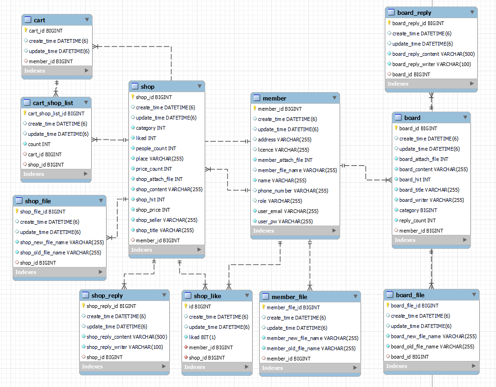
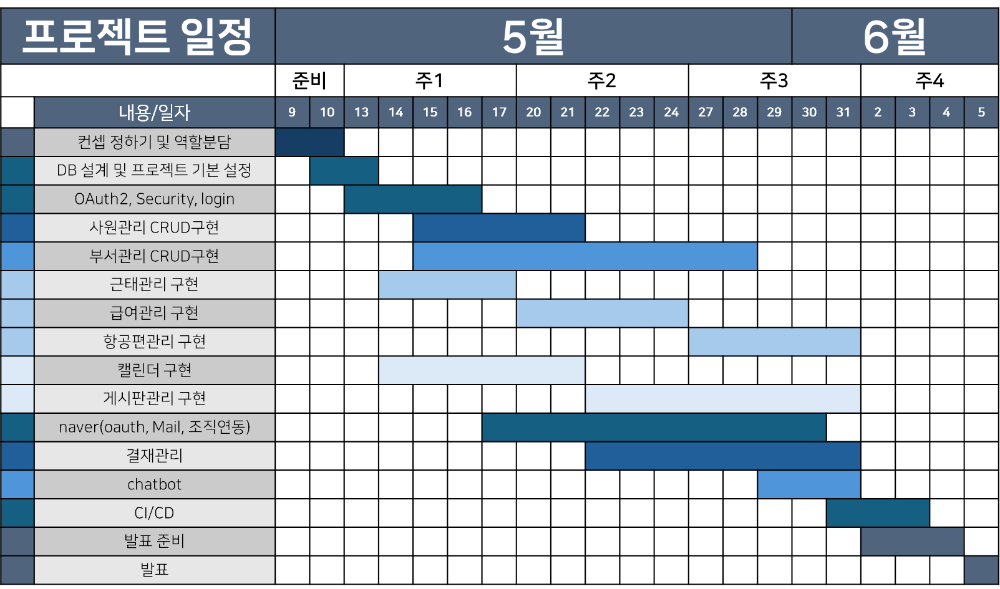
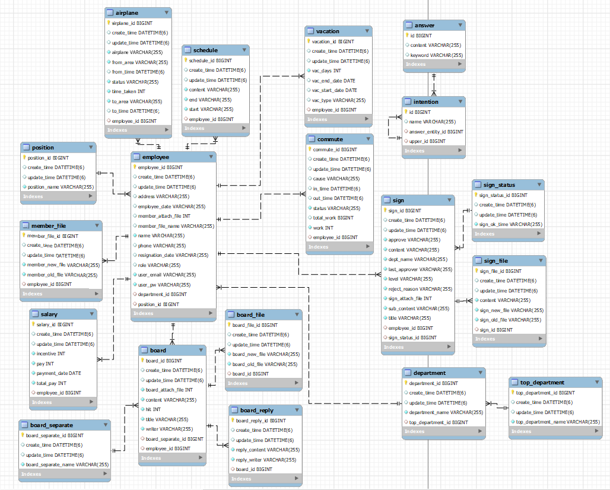

# 박준우 프로젝트

- - -

## 목차

### 1차 프로젝트

- [쇼핑몰 & 관리자 모드 기반 Chatbot 구현](#쇼핑몰--관리자-모드-기반-Chatbot-구현)

### 2차 프로젝트

- [그룹웨어 기본 연동 기능 및 메시지 봇 구현](#그룹웨어-기본-연동-기능-및-메시지-봇-구현)

### 3차 프로젝트

- [시나리오형 챗봇 웹 개발](#시나리오형-챗봇-웹-개발)

- - -

### 쇼핑몰 & 관리자 모드 기반 Chatbot 구현

#### **● 프로젝트 명** : E 1 I 4

#### **● 프로젝트 설명** : One Day Class 강의 쇼핑몰 사이트

#### **● 프로젝트 파일명** : Project1TeamE1I4, ProjectCICD

#### **● 팀원**

> 박준우 (팀장) : DB설계, 회원 CRUD, Oauth2, Security, CI/CD

> 손** (팀원) : 관리자페이지, Chatbot, 강사소개 페이지, 메뉴바, INDEX 애니메이션 기능

> 심** (팀원) : 게시판 CRUD, Naver API

> 이** (팀원) : 상품 CRUD, Cart 담당

> 조** (팀원) : INDEX 페이지, 1:1 문의내역, Naver API

- **Preview** 
    - 회원가입
       
      
       
       
    - 일반 회원 로그인
       
      
       
       
    - Oauth2 로그인
       
      
       
       
    - 수정, 삭제
       
      

 기술 스택 

| 카테고리     | 요소                                                                                                                  |
|----------|---------------------------------------------------------------------------------------------------------------------|
| 프로그래밍 언어 | JAVA                                                                                                                |
| 개발 툴     | IntelliJ                                                                                                            |
| 프레임워크    | Spring Boot 2.7.11                                                                                                  |
| 라이브러리 DI | Spring WEB(MVC), Thymeleaf, Spring Data JPA, Lombok, SpringSecurity5  , websocket, validation, OAuth2, security |
| 데이터베이스   | MySql8                                                                                                              |
| ORM      | Spring Data JPA (JAVA(SQL))                                                                                         |
| 템플릿 엔진   | Thymeleaf (HTML + Data)                                                                                             |
| FRONT    | css, javaScript, html, ajax                                                                                         |
| 설정       | application.yml, application-oauth2.yml                                                                             |

 프로젝트 일정 

 ER 다이어그램 

 기능 구현 

- DB 설계

  | **No** | **주요 Entity** | **상세 Entity**                                           |
              |--------|---------------|---------------------------------------------------------|
  | 1      | member        | member, memberFile                                      |
  | 2      | shop          | shop, cart, cartShopList, shopFile, shopReply, shopLike |
  | 3      | board         | board, boardReply, boardFile                            |

- 회원 CRUD

  | **No** | **기능**  | **설명**                                                                               |
            |--------|---------|--------------------------------------------------------------------------------------|
  | 1      | 회원가입    | 강사와 수강생으로 나누어 회원가입    비밀번호 확인 기능    전화번호 자동 하이픈(-)    프로필 사진 추가   유효성 검사 |
  | 2      | 회원정보 조회 | 회원 개인 정보 조회    간이 장바구니 기능                                                         |
  | 3      | 회원수정    | 프로필사진, 개인정보, 비밀번호 수정                                                                 |
  | 4      | 회원삭제    | 회원 탈퇴 기능                                                                             |

- 로그인

  | **No** | **기능**     | **설명**                                                                |
              |--------|------------|-----------------------------------------------------------------------|
  | 1      | 일반 회원 로그인  | Security를 통해 회원가입한 아이디로 로그인                                           |
  | 2      | Oauth2 로그인 | Oauth2를 이용하여 google, kakao, naver 아이디로 로그인   로그인시 아이디가 없으면 자동 회원가입 |

- CI/CD

  | **No** | **설명**                           |
              |--------|----------------------------------|
  | 1      | 배포할 파일 github push               |
  | 2      | git actions 실행                   |
  | 3      | 빌드한 프로젝트 압축                      |
  | 4      | 압축된 파일 S3 복사                     |
  | 5      | S3에 있는 파일을 CodeDeploy를 통해 EC2 배포 |
  | 6      | EC2에서 jar 파일 실행                  |

**[⬆ 위로 가기](#목차)**

- - -

### 그룹웨어 기본 연동 기능 및 메시지 봇 구현

#### **● 프로젝트 명** : Group Air

#### **● 프로젝트 설명** : 항공사 그룹웨어 시스템

#### **● 프로젝트 파일명** : Project23TeamGroupAir

#### **● 팀원**

> 박준우 (팀원) : 권한별 INDEX 페이지, 근태 관리 (출퇴근, 휴가), 급여 관리, 항공편관리(kakao map)

> 손** (팀장) : DB 설계, CI/CD, 로그인, 사원관리, Oauth, Mail, 조직연동

> 서** (팀원) : 회사일정, 게시판관리

> 정** (팀원) : 결제 관리

> 조** (팀원) : Layout(index), OpenWeather API, 부서관리, Chatbot

- **Preview** 
    - 권한별 INDEX
       
      
       
       
    - 출퇴근
       
      
       
       
    - 휴가
       
      
       
       
    - 급여 관리
       
      
       
       
    - 항공편 관리
       
      

 기술 스택 

| 카테고리     | 요소                                                                                                                                     |
|----------|----------------------------------------------------------------------------------------------------------------------------------------|
| 프로그래밍 언어 | JAVA                                                                                                                                   |
| 개발 툴     | IntelliJ                                                                                                                               |
| 프레임워크    | Spring Boot 2.7.11                                                                                                                     |
| 라이브러리 DI | Spring WEB(MVC), Thymeleaf, Spring Data JPA, Lombok, SpringSecurity5  , websocket, validation, OAuth2, security, komoran, queryDsl |
| 데이터베이스   | MySql8                                                                                                                                 |
| ORM      | Spring Data JPA (JAVA(SQL))                                                                                                            |
| 템플릿 엔진   | Thymeleaf (HTML + Data)                                                                                                                |
| FRONT    | css, javaScript, html, ajax                                                                                                            |
| API      | OpenWeather API, kakao Map API,                                                                                                        |
| 설정       | application.yml, application-oauth2.yml                                                                                                |

 프로젝트 일정 

 ER 다이어그램 

 기능 구현 

- 권한별 INDEX

  | **No** | **권한**      | **보여지는 기능**                                 |
                |--------|-------------|---------------------------------------------|
  | 1      | ADMIN(관리자)  | 근태관리, 부서관리, 회사 전체 일정, 게시판 관리, 항공편 관리, 직원 관리 |
  | 2      | MANAGER(부장) | 내 출근기록, 부서 인원, 오늘의 일정, 내 결재함, 내 휴가, 내 정보    |
  | 3      | MEMBER(사원)  | 내 출근기록, 자신 부서, 오늘의 일정, 내게 온 결재, 항공편, 내 정보   |

- 근태관리

  | **No** | **기능** | **설명**                                                                                        |
              |--------|--------|-----------------------------------------------------------------------------------------------|
  | 1      | 조회     | 출퇴근, 휴가 리스트 페이징 기능 , 사원 이름을 통한 조회                                                             |
  | 2      | 현황     | 출근, 퇴근, 지각, 조퇴 등 상태별 인원 출근 현황 출력                                                              |
  | 3      | 출퇴근    | 출근 혹은 퇴근시 시간에 따라 해당 직원 상태 변경, 총 근무시간 출력                                                       |
  | 4      | 휴가 등록  | 출발일과 복귀일을 입력하여 휴가 등록   자동 휴가 일수 계산   해당 인원이 겹치는 휴가 등록시 예외 처리   유효성 검사                |
  | 5      | 자동화    | 회원가입 시 근태 자동생성   휴가 인원 및 휴가 복귀인원 상태 변경    다음날이 되면 휴가인 인원 제외 '미출근'으로 상태 변경   지난 휴가 삭제 |

- 급여관리

  | **No** | **기능**  | **설명**                                    |
                |--------|---------|-------------------------------------------|
  | 1      | 직급 별 급여 | 직급별 월급 차등 저장                              |
  | 2      | 추가 수당   | 월 별 추가 근무 시간 계산 후 직급별 추가수당 차등 저장          |
  | 3      | 급여 조정   | 기본급여 변경을 통한 급여 조정                         |
  | 4      | 자동화     | 급여일 초과시 새로운 급여 레코드 생성   회원가입 시 급여 자동생성 |

- 항공편 관리(kakaoMap API)

  | **No** | **기능**     | **설명**                                                                |
                  |--------|------------|-----------------------------------------------------------------------|
  | 1      | 항공편 등록     | kakao 주소 API를 이용하여 출발지 목적지 저장   MANAGER 권한만 기장으로 등록 가능   유효성 검사 |
  | 2      | 항공편 수정, 삭제 | 항공편 정상 지연 수정기능, 항공편 삭제 기능                                             |
  | 3      | 항공편 정보     | kakao map api를 이용하여 항공편 거리 출발지 도착지 간략 표시                              |
  | 4      | 기장 관리      | 기장들의 자신의 전체 항공편과 오늘의 항공편 리스트 출력                                       |
  | 5      | 자동화        | 항공편 상태에 따른 항공편 리스트 표시 변경   운행중인 항공편 운행중 표시   지난 항공편 자동 삭제       |

**[⬆ 위로 가기](#목차)**

### 시나리오형 챗봇 웹 개발

**[⬆ 위로 가기](#목차)**

